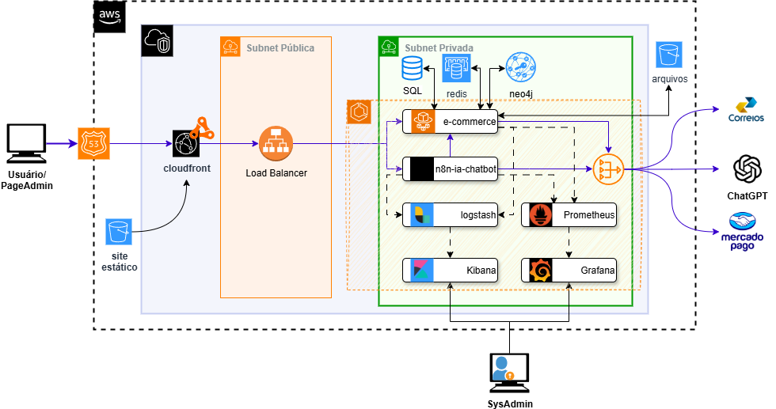

# SaaS E-commerce Workana

Este projeto é uma solução SaaS para e-commerce, permitindo que múltiplos lojistas criem e gerenciem suas lojas online de forma simples e escalável.

## Funcionalidades

- Cadastro e autenticação de lojistas
- Gerenciamento de produtos, categorias e estoque
- Processamento de pedidos e pagamentos
- Painel administrativo para relatórios e análises
- Integração com gateways de pagamento
- Suporte a múltiplos temas e personalização de lojas

## Tecnologias Utilizadas

- Backend: Node.js, Express
- Frontend: React.js
- Banco de Dados: PostgreSQL, Redis e Neo4J
- Autenticação: JWT
- Armazenamento de arquivos: AWS S3
- Infraestrutura: Docker, NGINX, ECS

## Arquitetura

A arquitetura do projeto segue o padrão de microsserviços, garantindo escalabilidade e facilidade de manutenção. Os principais componentes são:

- **API Gateway:** Gerencia o roteamento das requisições.
- **Serviço de Autenticação:** Responsável pelo login e registro de usuários.
- **Serviço de Produtos:** Gerencia o catálogo de produtos.
- **Serviço de Pedidos:** Processa e acompanha os pedidos.
- **Frontend Web:** Interface para lojistas e clientes.
- **Banco de Dados:** Armazena informações persistentes.

